# BoardGame — CI/CD Pipeline with Jenkins, SonarQube, Nexus, Docker and Kubernetes


A Jenkins CI/CD pipeline built on GCP infrastructure. It covers automated testing, static code analysis, security scanning, artefact management, containerisation, Kubernetes deployment and full-stack observability.

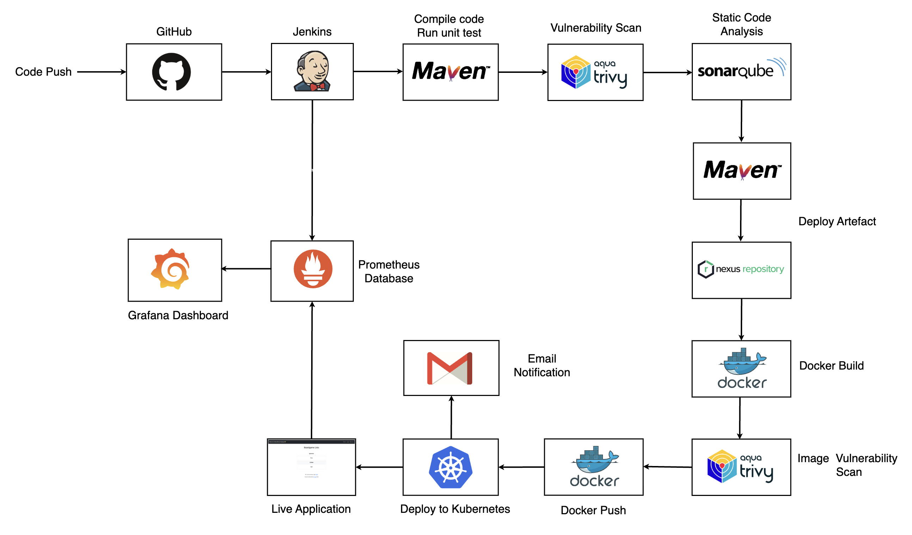

---

## Table of Contents

- [Learning Objectives](#learning-objectives)
- [Pipeline Overview](#pipeline-overview)
- [Infrastructure Setup](#infrastructure-setup)
  - [GCP Networking](#gcp-networking)
  - [Server Overview](#server-overview)
  - [SonarQube Server Setup](#sonarqube-server-setup)
  - [Nexus Repository Setup](#nexus-repository-setup)
  - [Kubernetes Cluster Setup](#kubernetes-cluster-setup)
    - [Kubernetes RBAC for Jenkins](#kubernetes-rbac-for-jenkins)
  - [Jenkins Server Setup](#jenkins-server-setup)
- [Jenkins Configuration](#jenkins-configuration)
  - [Required Plugins](#required-plugins)
  - [Global Tool Configuration](#global-tool-configuration)
  - [SonarQube Integration](#sonarqube-integration)
  - [Credentials](#credentials)
  - [Nexus Authentication](#nexus-authentication)
- [Pipeline Configuration](#pipeline-configuration)
- [Code Quality and Coverage](#code-quality-and-coverage)
- [Security Scanning](#security-scanning)
- [Artefact Management](#artefact-management)
- [Container Strategy](#container-strategy)
- [Observability](#observability)
  - [Monitoring Stack](#monitoring-stack)
  - [What Is Monitored](#what-is-monitored)
  - [Docker Compose Setup](#docker-compose-setup)
  - [Node Exporter Setup](#node-exporter-setup)
  - [Boot Persistence](#boot-persistence)
  - [Grafana Dashboards](#grafana-dashboards)
- [Email Notifications](#email-notifications)
- [Learnings and Challenges](#learnings-and-challenges)
- [References](#references)
- [Contact](#contact)

---

## Learning Objectives

This project was built to demonstrate practical, hands-on DevOps engineering in the following areas:

- Designing a **multi-stage declarative Jenkins pipeline** covering build, test, quality, security, publish and deploy
- Integrating **SonarQube** for static analysis across Java, HTML and JavaScript with accurate coverage reporting
- Configuring **JaCoCo** for Java test coverage and correctly surfacing it in SonarQube
- Publishing build artefacts to **Nexus Repository Manager** using Maven deployment with credential injection
- Building and scanning **Docker images** with Trivy security scanning
- Deploying to **Kubernetes** using a least-privilege RBAC service account
- Implementing **observability** across infrastructure, application and CI/CD layers using Prometheus, Grafana, Blackbox Exporter and Node Exporter
- Configuring **automated email notifications** with HTML formatting, JaCoCo coverage metrics, SonarQube links and Trivy security reports attached per build

> **Note:** This project prioritises infrastructure and DevOps pipeline engineering, not application development. The Spring Boot application serves as a realistic workload to apply CI/CD practices against — the focus is entirely on the automated, secure delivery of software to production, not on the application itself.

---

## Pipeline Overview

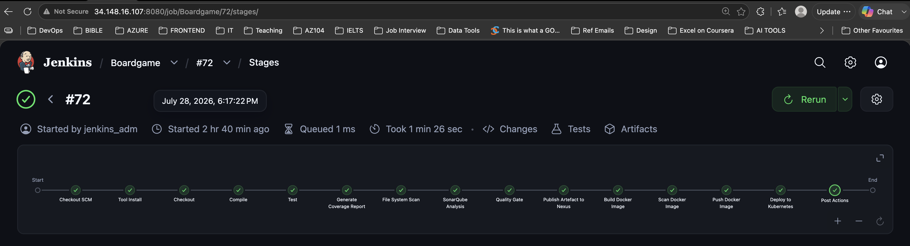

The pipeline implements a **shift-left** approach — catching bugs, vulnerabilities, and quality issues as early as possible in the delivery process, long before code reaches production. Security scanning runs on both the filesystem before packaging and on the Docker image after building. Quality gates block promotion if standards are not met.

Every stage produces a traceable output — test results, coverage reports, Trivy HTML reports, SonarQube analysis, a versioned JAR in Nexus, and a tagged Docker image — giving complete visibility into what was built, how it performed, and what was deployed.

---

## Infrastructure Setup

### GCP Networking


---

### Server Overview

All servers are provisioned on GCP virtual machines with the following naming convention:

-  — Short form for Raven (project tag)
-  — Server location
-  — Service abbreviation
-  — Server
-  — Node number (for multi-node services)

| Server | Role |
|---|---|
| `rv-gcp-son-svr` | SonarQube — code quality |
| `rv-gcp-nex-svr` | Nexus — artefact repository |
| `rv-gcp-mon-svr` | Monitoring — Prometheus, Grafana, Blackbox Exporter |
| `rv-gcp-k8-svr1` | Kubernetes master node |
| `rv-gcp-k8-svr2` | Kubernetes worker node |
| `rv-gcp-k8-svr3` | Kubernetes worker node |
| `rv-gcp-jenk-svr` | Jenkins controller |

---

### SonarQube Server Setup

SonarQube runs as a Docker container managed by Docker Compose. Docker must be installed on the server before running the Compose file below:

```yaml
services:
  sonarqube:
    image: sonarqube:community
    container_name: sonarqube
    restart: unless-stopped
    ports:
      - "9000:9000"
    ulimits:
      nofile:
        soft: 65536
        hard: 65536
    volumes:
      - sonarqube_extensions:/opt/sonarqube/extensions
      - sonarqube_data:/opt/sonarqube/data
      - sonarqube_logs:/opt/sonarqube/logs

volumes:
  sonarqube_extensions:
  sonarqube_data:
  sonarqube_logs:
```

**SonarQube post-installation steps:**

1. An authentication token was generated for Jenkins user: **My Account → Security → Generate Token**

---

### Nexus Repository Setup

Nexus runs as a Docker container managed by Docker Compose. Docker must be installed on the server before running the Compose file below:

```yaml
services:
  nexus:
    image: sonatype/nexus3
    container_name: nexus
    restart: unless-stopped
    ports:
      - "8081:8081"
    volumes:
      - nexus-data:/nexus-data

volumes:
  nexus-data:
```

**Nexus post-installation steps:**

- Two hosted maven repositories were created in Nexus to store the artefacts
- A dedicated Jenkins user was created in Nexus with deploy permissions

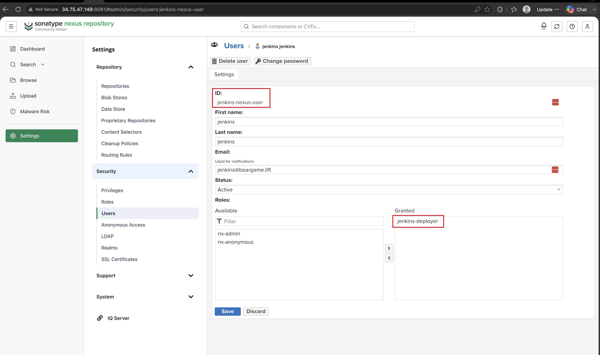

---

### Kubernetes Cluster Setup

#### Prepare all nodes

```bash
#!/bin/bash

sudo apt update && sudo apt upgrade -y
sudo swapoff -a
sudo sed -i '/ swap / s/^/#/' /etc/fstab
sudo apt install -y apt-transport-https ca-certificates curl gnupg lsb-release

# Load required kernel modules
sudo modprobe overlay
sudo modprobe br_netfilter

cat <<EOF | sudo tee /etc/modules-load.d/k8s.conf
overlay
br_netfilter
EOF

# Load required system parameters
sudo sysctl -w net.bridge.bridge-nf-call-iptables=1
sudo sysctl -w net.bridge.bridge-nf-call-ip6tables=1
sudo sysctl -w net.ipv4.ip_forward=1

cat <<EOF | sudo tee /etc/sysctl.d/k8s.conf
net.bridge.bridge-nf-call-iptables = 1
net.bridge.bridge-nf-call-ip6tables = 1
net.ipv4.ip_forward = 1
EOF

sudo sysctl --system

# Install containerd
sudo apt install -y containerd
sudo mkdir -p /etc/containerd
containerd config default | sudo tee /etc/containerd/config.toml
sudo sed -i 's/SystemdCgroup = false/SystemdCgroup = true/' /etc/containerd/config.toml
sudo systemctl restart containerd
sudo systemctl enable containerd

# Add Kubernetes repository
sudo curl -fsSL https://pkgs.k8s.io/core:/stable:/v1.30/deb/Release.key \
  | sudo gpg --dearmor -o /etc/apt/keyrings/kubernetes-apt-keyring.gpg

echo "deb [signed-by=/etc/apt/keyrings/kubernetes-apt-keyring.gpg] \
https://pkgs.k8s.io/core:/stable:/v1.30/deb/ /" \
| sudo tee /etc/apt/sources.list.d/kubernetes.list

sudo apt update
sudo apt install -y kubelet kubeadm kubectl
sudo apt-mark hold kubelet kubeadm kubectl
```

**Initialise the control plane (master node only):**

```bash
sudo kubeadm init --pod-network-cidr=192.168.0.0/16

mkdir -p $HOME/.kube
sudo cp -i /etc/kubernetes/admin.conf $HOME/.kube/config
sudo chown $(id -u):$(id -g) $HOME/.kube/config

# Install Calico CNI — must be v3.27.0, NOT v3.27.2
# v3.27.2 has a known mount-bpffs crash on ARM64
kubectl apply -f https://raw.githubusercontent.com/projectcalico/calico/v3.27.0/manifests/calico.yaml
```

**Join worker nodes** using the token from `kubeadm init` output:

```bash
sudo kubeadm join 10.0.1.2:6443 --token <token> \
    --discovery-token-ca-cert-hash sha256:<hash>
```

---

#### Kubernetes RBAC for Jenkins

Jenkins deploys using a dedicated service account with **least-privilege** permissions scoped exclusively to the `boardgame` namespace. It cannot affect any other namespace or cluster-level resources.

```yaml
# jenkins-rbac.yaml
apiVersion: v1
kind: Namespace
metadata:
  name: boardgame
---
apiVersion: v1
kind: ServiceAccount
metadata:
  name: jenkins
  namespace: boardgame
---
apiVersion: rbac.authorization.k8s.io/v1
kind: Role
metadata:
  name: jenkins-deployer
  namespace: boardgame
rules:
  - apiGroups: ["apps"]
    resources: ["deployments", "replicasets", "statefulsets"]
    verbs: ["get", "list", "watch", "create", "update", "patch", "delete"]
  - apiGroups: [""]
    resources: ["pods", "pods/log", "pods/exec", "services",
                "configmaps", "secrets", "serviceaccounts", "events"]
    verbs: ["get", "list", "watch", "create", "update", "patch", "delete"]
  - apiGroups: ["networking.k8s.io"]
    resources: ["ingresses"]
    verbs: ["get", "list", "watch", "create", "update", "patch", "delete"]
---
apiVersion: rbac.authorization.k8s.io/v1
kind: RoleBinding
metadata:
  name: jenkins-deployer-binding
  namespace: boardgame
subjects:
  - kind: ServiceAccount
    name: jenkins
    namespace: boardgame
roleRef:
  kind: Role
  name: jenkins-deployer
  apiGroup: rbac.authorization.k8s.io
```

```bash
# Apply RBAC manifest
kubectl apply -f jenkins-rbac.yaml

# Create long-lived token for the service account
# (Kubernetes 1.24+ no longer auto-generates tokens)
kubectl apply -f - <<EOF
apiVersion: v1
kind: Secret
metadata:
  name: jenkins-deployer-token
  namespace: boardgame
  annotations:
    kubernetes.io/service-account.name: jenkins
type: kubernetes.io/service-account-token
EOF

# Retrieve the token and store in Jenkins credentials
kubectl get secret jenkins-deployer-token \
    --namespace boardgame \
    -o jsonpath='{.data.token}' | base64 --decode
```

---

### Jenkins Server Setup

The following script installs Jenkins, Docker and Trivy, following the official installation guides for each tool.

```bash
#!/bin/bash

sudo apt install -y wget gnupg ca-certificates curl

#============ JENKINS INSTALLATION =============================

# Install Java 25 (Jenkins runtime)
sudo apt update && sudo apt install -y openjdk-25-jdk

# Add Jenkins repository to Apt sources
sudo wget -O /etc/apt/keyrings/jenkins-keyring.asc \
  https://pkg.jenkins.io/debian-stable/jenkins.io-2026.key
echo "deb [signed-by=/etc/apt/keyrings/jenkins-keyring.asc]" \
  https://pkg.jenkins.io/debian-stable binary/ | sudo tee \
  /etc/apt/sources.list.d/jenkins.list > /dev/null

# Install Jenkins
sudo apt update && sudo apt install -y jenkins

#=============== DOCKER INSTALLATION ==========================

sudo apt update
sudo install -m 0755 -d /etc/apt/keyrings
sudo curl -fsSL https://download.docker.com/linux/ubuntu/gpg -o /etc/apt/keyrings/docker.asc
sudo chmod a+r /etc/apt/keyrings/docker.asc

# Add Docker repository to Apt sources
sudo tee /etc/apt/sources.list.d/docker.sources <<EOF
Types: deb
URIs: https://download.docker.com/linux/ubuntu
Suites: $(. /etc/os-release && echo "${UBUNTU_CODENAME:-$VERSION_CODENAME}")
Components: stable
Architectures: $(dpkg --print-architecture)
Signed-By: /etc/apt/keyrings/docker.asc
EOF

sudo apt update
sudo apt install -y docker-ce docker-ce-cli containerd.io docker-buildx-plugin docker-compose-plugin

# Add Jenkins to docker group
sudo usermod -aG docker jenkins
sudo systemctl restart jenkins

#============ TRIVY INSTALLATION ==========================

wget -qO - https://aquasecurity.github.io/trivy-repo/deb/public.key | gpg --dearmor | sudo tee /usr/share/keyrings/trivy.gpg > /dev/null
echo "deb [signed-by=/usr/share/keyrings/trivy.gpg] https://aquasecurity.github.io/trivy-repo/deb generic main" | sudo tee -a /etc/apt/sources.list.d/trivy.list

sudo apt update && sudo apt-get install -y trivy
```

> **Jenkins Docker group membership:** The Docker daemon binds to a Unix socket owned by root. Jenkins must be in the `docker` group to send commands to this socket without using sudo.

---

## Jenkins Configuration

### Required Plugins

Install via **Manage Jenkins → Plugins → Available plugins**:

| Plugin | What it enables in the pipeline |
|---|---|
| Pipeline | Jenkinsfile and declarative pipeline syntax |
| Git | `checkout scm` step and GitHub webhook support |
| Maven Integration | `maven` tool type in Global Tool Configuration |
| NodeJS Plugin | `nodejs` tool type — required by SonarQube JS analysis |
| SonarQube Scanner | `withSonarQubeEnv()` step and sonar-scanner tool type |
| Config File Provider | Managed `settings.xml` for Nexus credentials |
| Pipeline Maven Integration | `withMaven()` step with automatic credential injection |
| Kubernetes Credentials | `withKubeConfig()` step for cluster access |
| HTML Publisher | Publishes JaCoCo HTML report as a build artefact |
| Workspace Cleanup | `cleanWs()` step for reproducible builds |
| Email Extension Plugin | `emailext` step for HTML email notifications |

---

### Global Tool Configuration

To reference tools in a Jenkins pipeline, they must first be configured in Global Tool Configuration. Each tool requires two things — a **type keyword** that identifies the tool category (provided by the plugin that registered it) and a **name** that you assign and reference in the Jenkinsfile.

Go to **Manage Jenkins → Global Tool Configuration**

| Tool Type | Name in Jenkins | Version | How referenced in Jenkinsfile |
|---|---|---|---|
| JDK | `jdk25` | Java 25 (Adoptium) | `tools { jdk 'jdk25' }` |
| Maven | `maven3` | 3.9.16 | `tools { maven 'maven3' }` |
| NodeJS | `nodejs` | 24.x LTS | `tools { nodejs 'nodejs' }` |
| SonarQube Scanner | `sonar-scanner` | Latest | `SCANNER_HOME = tool 'sonar-scanner'` |

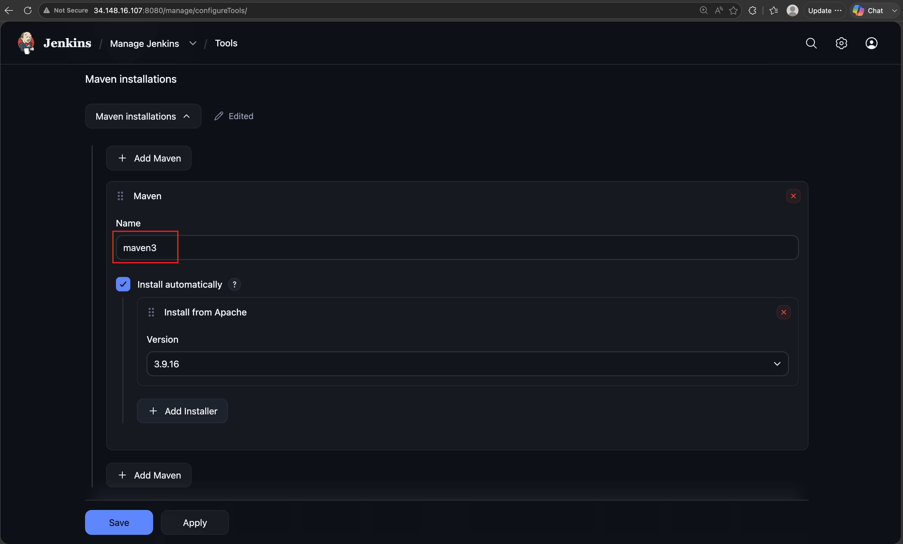

> The `tools` block adds the tool's `bin/` directory to `PATH` — enabling `mvn`, `java`, and `node` commands directly. The `tool()` function returns the full installation path — used for SonarQube Scanner which is invoked via `$SCANNER_HOME/bin/sonar-scanner`.

---

### SonarQube Integration

The SonarQube server must be registered in Jenkins before `withSonarQubeEnv()` can be used in the pipeline. SonarQube must already be running and its token generated before this step.

This is configured at **Manage Jenkins → Configure System**:

1. Scroll to the **SonarQube servers** section
2. Check **Environment variables** — enables `withSonarQubeEnv()` in the pipeline
3. Click **Add SonarQube** and fill in:

| Field | Value |
|---|---|
| Name | `sonarqube` — must match the name used in `withSonarQubeEnv('sonarqube')` in the Jenkinsfile |
| Server URL | `http://<sonarqube-server-ip>:9000` |
| Server authentication token | Select the `sonar-token` credential created earlier |

4. Click **Save**

> The **Name** field is case sensitive and must match exactly what is passed to `withSonarQubeEnv()` in the Jenkinsfile.

---

### Credentials

Credentials are required for Jenkins to authenticate with the different servers and services referenced in the pipeline. They are configured at **Manage Jenkins → Credentials → Global → Add Credentials**:

| ID | Kind | Used in pipeline |
|---|---|---|
| `docker-cred` | Username with password | `withCredentials` in Build Docker Image stage |
| `git-cred` | Username with password | GitHub authentication |
| `k8-cred` | Secret text | `withKubeConfig` in Deploy to Kubernetes stage |
| `sonar-token` | Secret text | SonarQube server configuration |
| `mail-cred` | Username with password | Gmail app credentials |

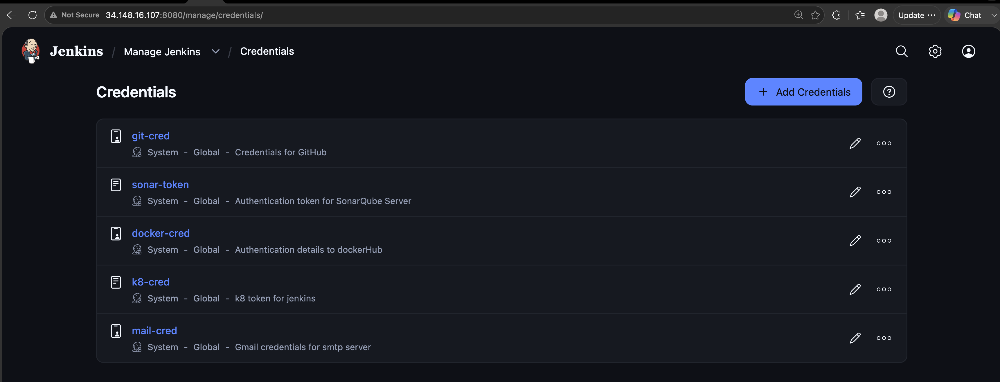

---

### Nexus Authentication

The **Config File Provider Plugin** manages `settings.xml` inside Jenkins. Maven uses `settings.xml` to store authentication credentials that `pom.xml` cannot hold securely. By managing `settings.xml` through Jenkins, Nexus credentials are kept out of the repository entirely and injected securely at build time.

1. Go to **Manage Jenkins → Managed Files → Add a New Config**
2. Select **Maven settings.xml**
3. Set ID: `global-settings`
4. Add server credentials:

```xml
<settings>
    <servers>
        <server>
            <id>maven-releases</id>
            <username>jenkins-nexus-user</username>
            <password>enter-password</password>
        </server>
        <server>
            <id>maven-snapshots</id>
            <username>jenkins-nexus-user</username>
            <password>enter-password</password>
        </server>
    </servers>
</settings>
```

The `id` values must match the `<id>` in `pom.xml` `distributionManagement`. The ID is how Maven knows which credentials to use for which Nexus repository.

---

## Pipeline Configuration

The pipeline uses **declarative syntax** with a single agent and explicit tool declarations. Each stage has a single, clearly defined responsibility.

```groovy
pipeline {
    agent any

    environment {
        DOCKERHUB_USER = 'aayodeji'
        DOCKERHUB_REPO = 'boardgame'
        IMAGE_TAG      = "latest"
        K8S_MANIFEST   = 'deployment-service.yaml'
        SCANNER_HOME   = tool 'sonar-scanner'   // tool() returns install path
    }

    tools {
        jdk    'jdk25'      // adds java to PATH
        maven  'maven3'     // adds mvn to PATH
        nodejs 'nodejs'     // adds node to PATH — required by SonarQube JS analysis
    }

    stages {

        stage('Checkout') {
            steps {
                cleanWs()        // wipe workspace for reproducible builds
                checkout scm     // clone from configured SCM
            }
        }

        stage('Compile') {
            steps {
                sh 'mvn clean compile'    // clean ensures no stale .class files
            }
        }

        stage('Test') {
            steps {
                // JaCoCo agent attaches automatically via prepare-agent goal
                // configured in pom.xml — no explicit flag needed here
                sh 'mvn test'
            }
        }

        stage('Generate Coverage Report') {
            steps {
                // converts jacoco.exec binary → jacoco.xml for SonarQube
                // and index.html for human viewing
                // must run BEFORE SonarQube analysis
                sh 'mvn jacoco:report'
                sh 'ls -la target/site/jacoco/jacoco.xml'    // verify exists
            }
        }

        stage('File System Scan') {
            steps {
                sh '''
                    mkdir -p reports
                    trivy fs --format table -o reports/trivy-fs-report.html .
                '''
                // output to reports/ directory to prevent SonarQube
                // from scanning the HTML report as source code
            }
        }

        stage('SonarQube Analysis') {
            steps {
                withSonarQubeEnv('sonarqube') {
                    sh '''
                        $SCANNER_HOME/bin/sonar-scanner \
                            -Dsonar.projectName=BoardGame \
                            -Dsonar.projectKey=BoardGame \
                            -Dsonar.sources=src/main/java,src/main/resources \
                            -Dsonar.tests=src/test/java \
                            -Dsonar.java.binaries=target/classes \
                            -Dsonar.java.libraries=$HOME/.m2/repository/**/*.jar \
                            -Dsonar.coverage.jacoco.xmlReportPaths=target/site/jacoco/jacoco.xml \
                            -Dsonar.coverage.exclusions=src/main/resources/**
                    '''
                }
            }
        }

        stage('Quality Gate') {
            steps {
                timeout(time: 1, unit: 'HOURS') {
                    waitForQualityGate abortPipeline: false
                }
            }
        }

        stage('Publish Artefact to Nexus') {
            steps {
                withMaven(
                    globalMavenSettingsConfig: 'global-settings',
                    jdk: 'jdk25',
                    maven: 'maven3',
                    traceability: true
                ) {
                    sh 'mvn deploy'
                }
            }
        }

        stage('Build Docker Image') {
            steps {
                withCredentials([usernamePassword(
                    credentialsId: 'docker-cred',
                    usernameVariable: 'DOCKER_USERNAME',
                    passwordVariable: 'DOCKER_PASSWORD'
                )]) {
                    sh '''
                        echo "$DOCKER_PASSWORD" | docker login \
                            -u "$DOCKER_USERNAME" --password-stdin
                        docker build -t ${DOCKERHUB_USER}/${DOCKERHUB_REPO}:${IMAGE_TAG} .
                    '''
                }
            }
        }

        stage('Scan Docker Image') {
            steps {
                sh '''
                    trivy image --format table \
                        -o reports/trivy-image-report.html \
                        ${DOCKERHUB_USER}/${DOCKERHUB_REPO}:${IMAGE_TAG}
                '''
            }
        }

        stage('Push Docker Image') {
            steps {
                sh 'docker push ${DOCKERHUB_USER}/${DOCKERHUB_REPO}:${IMAGE_TAG}'
            }
        }

        stage('Deploy to Kubernetes') {
            steps {
                withKubeConfig(
                    caCertificate: '',
                    clusterName: 'kubernetes',
                    contextName: '',
                    credentialsId: 'k8-cred',
                    namespace: 'boardgame',
                    restrictKubeConfigAccess: false,
                    serverUrl: 'https://10.0.1.2:6443'
                ) {
                    sh '''
                        sed -i "s|IMAGE_TAG|${IMAGE_TAG}|g" ${K8S_MANIFEST}
                        kubectl apply -f ${K8S_MANIFEST}
                        kubectl get pods -n boardgame
                        kubectl get svc -n boardgame
                    '''
                }
            }
        }
    }

    post {
        always {
            archiveArtifacts artifacts: 'reports/trivy-fs-report.html, reports/trivy-image-report.html',
                             fingerprint: true

            publishHTML(target: [
                allowMissing: false,
                alwaysLinkToLastBuild: true,
                keepAll: true,
                reportDir: 'target/site/jacoco',
                reportFiles: 'index.html',
                reportName: 'JaCoCo Coverage Report'
            ])
        }
        success {
            echo "Pipeline completed — image: ${DOCKERHUB_USER}/${DOCKERHUB_REPO}:${IMAGE_TAG}"
        }
        failure {
            echo "Pipeline failed at build ${BUILD_NUMBER}"
        }
    }
}
```

---

## Code Quality and Coverage

SonarQube analyses the project on two dimensions simultaneously: **code quality** across all source types, and **test coverage** restricted to Java only.

```
src/main/java        → quality analysis + coverage measurement
src/main/resources   → quality analysis only
src/test/java        → test source — not analysed for quality
```

This separation is critical. Without it, HTML, CSS and SQL files with no coverage data drag the overall coverage metric down from the true Java figure, creating a false picture of test quality.

**Code Quality result from SonarQube**

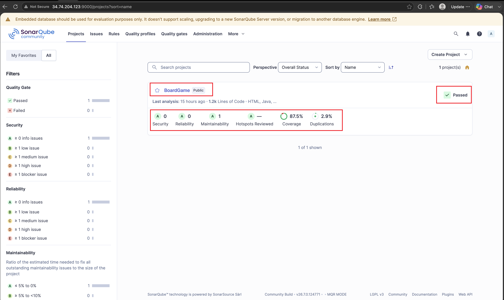

**Test Coverage result from JaCoCo**

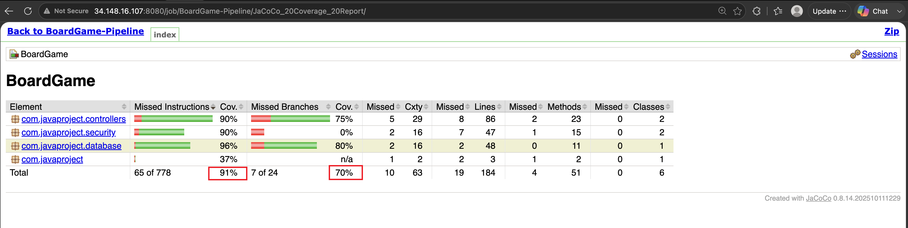

> Security branch coverage is 0% because triggering a real 403 access denied event in tests requires additional MockMvc security configuration beyond the current test suite.

The JaCoCo HTML report is published directly to the Jenkins build page via `publishHTML` and accessible at **Build → JaCoCo Coverage Report**.

---

## Security Scanning

Trivy runs at two points in the pipeline:

- **Filesystem scan** — runs before packaging, scanning the source code and `pom.xml` for known CVEs in declared dependencies. Output saved to `reports/trivy-fs-report.html`.

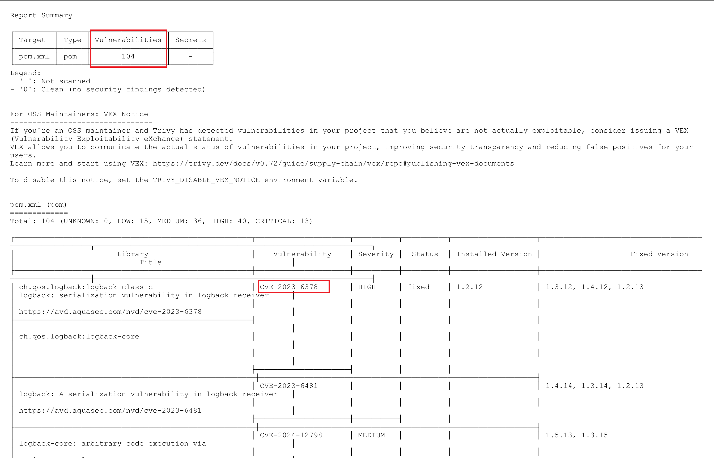

- **Image scan** — runs after the Docker image is built, scanning OS packages and library layers for vulnerabilities. This catches issues introduced by the base image that the filesystem scan cannot see. Output saved to `reports/trivy-image-report.html`.

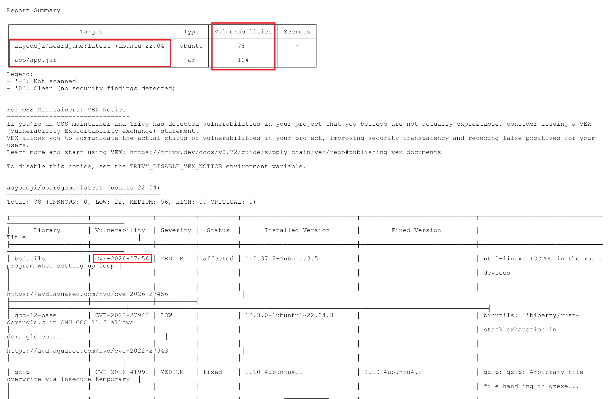

Both reports are archived as Jenkins build artefacts and available for download from the build page. The `reports/` directory is explicitly separated from source code to prevent SonarQube from treating Trivy HTML output as analysable source files.

---

## Artefact Management

Maven's `deploy` lifecycle phase pushes the built JAR to Nexus using coordinates from `pom.xml`:

```
com.javaproject:BoardGame:0.0.5-SNAPSHOT
```

The `-SNAPSHOT` suffix routes to `maven-snapshots`. Removing it and changing to a fixed version number (e.g. `0.0.5`) routes to `maven-releases` — which is immutable. Once a release version is published it cannot be overwritten, providing an auditable history of every production build.

The `withMaven()` step with `traceability: true` attaches Jenkins build metadata to the Nexus artefact; build number, Git commit hash, and branch name. This ensures that any artefact in Nexus can be traced back to the exact pipeline run and source commit that produced it.

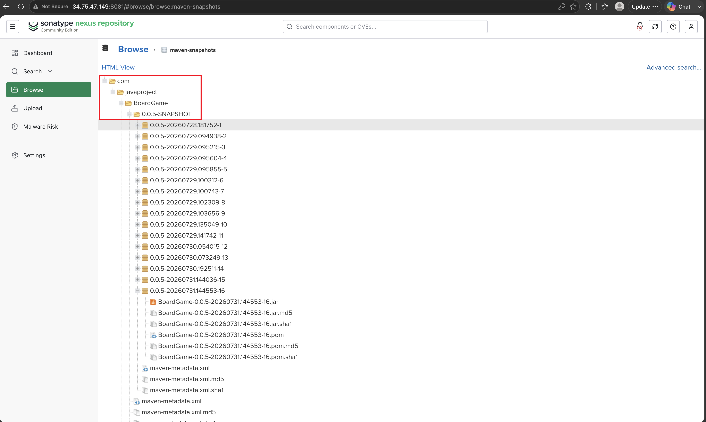

---

## Container Strategy

The Dockerfile uses a **multi-stage build** to keep the final image small and secure:

```dockerfile
# Stage 1 — build (includes JDK, Maven, source code)
FROM maven:3.9.9-eclipse-temurin-17 AS build
WORKDIR /app
COPY pom.xml .
RUN mvn -B -q -DskipTests dependency:go-offline
COPY src ./src
RUN mvn clean package -DskipTests

# Stage 2 — runtime (JRE only, no build tools, no source code)
FROM eclipse-temurin:17-jre-jammy
WORKDIR /app

# Non-root user — fixes SonarQube Dockerfile security warning
RUN groupadd --system appgroup && \
    useradd --system --gid appgroup --no-create-home appuser

COPY --from=build /app/target/*.jar app.jar
RUN chown appuser:appgroup app.jar
USER appuser

EXPOSE 8080
ENTRYPOINT ["java", "-jar", "app.jar"]
```

The runtime image contains only what is needed to run the application — the JRE, the JAR, and a non-root user. The JDK, Maven, and source code from the build stage are discarded, minimising the attack surface and reducing the image size significantly.

Security is reinforced in the Kubernetes deployment manifest:

```yaml
securityContext:
  runAsNonRoot: true
  allowPrivilegeEscalation: false
automountServiceAccountToken: false
resources:
  requests:
    memory: "256Mi"
    cpu: "250m"
  limits:
    memory: "512Mi"
    cpu: "500m"
```

---

## Observability

The pipeline is complemented by a monitoring stack that provides observability across three layers: infrastructure health, application uptime, and CI/CD pipeline metrics. All monitoring components run as Docker containers on `rv-gcp-mon-svr`, managed by Docker Compose and configured to start automatically on server boot via a systemd service unit.

### Monitoring Stack

| Component | Role | Port |
|---|---|---|
| Prometheus | Metrics collection and time series storage | 9090 |
| Grafana | Visualisation and dashboards | 3000 |
| Blackbox Exporter | Active endpoint probing | 9115 |
| Node Exporter | Host-level system metrics | 9100 |

### What Is Monitored

1. **Infrastructure — Node Exporter scrapes metrics from Jenkins server:**

   - CPU usage per core, memory and swap utilisation
   - Disk read/write throughput and filesystem usage
   - Network bytes in/out per interface
   - System load average and uptime

2. **Application — Blackbox Exporter:**

   - BoardGame application uptime on Kubernetes
   - HTTP status code and end-to-end response time
   - HTTP duration breakdown — DNS lookup, TCP connect, processing, transfer
   - SSL certificate validity and expiry (for HTTPS targets)

3. **CI/CD — Jenkins Prometheus plugin monitors the Job:**

   - Build queue depth and executor utilisation
   - Build counts and durations exposed at `/prometheus`

### Docker Compose Setup

```yaml
services:
  prometheus:
    image: prom/prometheus
    container_name: prometheus
    restart: unless-stopped
    ports:
      - "9090:9090"
    volumes:
      - prometheus-data:/prometheus
      - /home/monitor_adm/config-files/prometheus.yml:/etc/prometheus/prometheus.yml

  blackbox-exporter:
    image: prom/blackbox-exporter
    container_name: blackbox-exporter
    restart: unless-stopped
    ports:
      - "9115:9115"
    volumes:
      - /home/monitor_adm/config-files/blackbox.yml:/etc/blackbox_exporter/config.yml

  grafana:
    image: grafana/grafana
    container_name: grafana
    restart: unless-stopped
    depends_on:
      - prometheus
    ports:
      - "3000:3000"
    volumes:
      - grafana-data:/var/lib/grafana

volumes:
  prometheus-data:
  grafana-data:
```

### Node Exporter Setup

Node Exporter runs on the Jenkins server, managed by Docker Compose with `network_mode: host` and `pid: host` to access real host-level metrics rather than the container's isolated view.

```yaml
services:
  node_exporter:
    image: quay.io/prometheus/node-exporter:latest
    container_name: node_exporter
    command:
      - '--path.rootfs=/host'
      - '--collector.pressure'
    network_mode: host
    pid: host
    restart: unless-stopped
    volumes:
      - '/:/host:ro,rslave'
```

### Boot Persistence

Two systemd service units ensure the monitoring stack and the node-exporter services start automatically in the event of server reboot:

**Systemd unit file for monitoring stack on the Monitor Server:**

```ini
[Unit]
Description=Monitoring Stack — Prometheus, Grafana, Blackbox Exporter
Requires=docker.service
After=docker.service network-online.target
Wants=network-online.target

[Service]
Type=oneshot
RemainAfterExit=yes
WorkingDirectory=/home/monitor_adm/compose-files/
ExecStart=/usr/bin/docker compose up -d
ExecStop=/usr/bin/docker compose down
TimeoutStartSec=300
Restart=on-failure
RestartSec=10

[Install]
WantedBy=multi-user.target
```

```bash
sudo systemctl enable monitoring.service
sudo systemctl start monitoring.service
```

**Monitoring service started successfully**

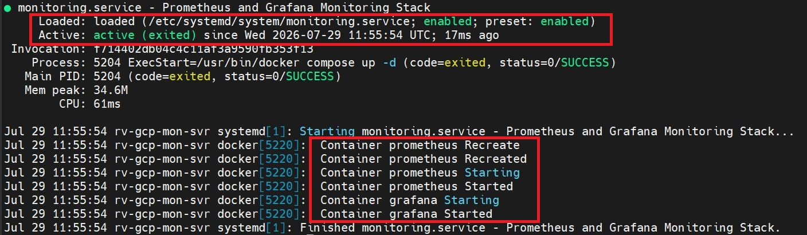

**Systemd unit file for node-exporter service on Jenkins host:**

```ini
[Unit]
Description=Node Exporter
Requires=docker.service
After=docker.service network-online.target
Wants=network-online.target

[Service]
Type=oneshot
RemainAfterExit=yes
WorkingDirectory=/home/jenkins_adm/compose-files/node-exporter/
ExecStart=/usr/bin/docker compose up -d
ExecStop=/usr/bin/docker compose down
TimeoutStartSec=300
Restart=on-failure
RestartSec=10

[Install]
WantedBy=multi-user.target
```

```bash
sudo systemctl enable node-exporter.service
sudo systemctl start node-exporter.service
```

### Grafana Dashboards

**Jenkins Host Resource Usage**

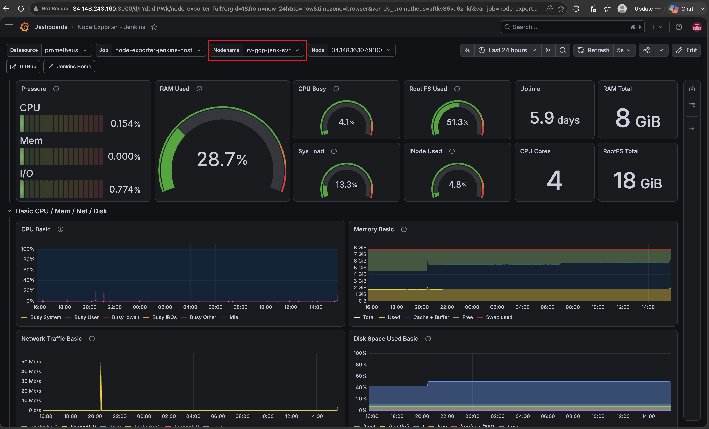

---

**Live Website Monitor**

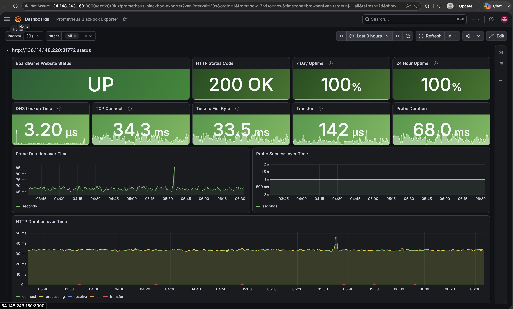

---

## Email Notifications

The pipeline sends an automated HTML email after every build via the **Email Extension Plugin**, providing a full summary of the build result without needing to open Jenkins.

### Prerequisites

1. Install **Email Extension Plugin** via **Manage Jenkins → Plugins**
2. Configure SMTP in **Manage Jenkins → Configure System → Extended E-mail Notification**:

| Field | Value |
|---|---|
| SMTP Server | `smtp.gmail.com` |
| SMTP Port | `465` |
| Credentials | Your email credentials stored in Jenkins |
| Use SSL | Enabled |

### What Each Email Contains

| Section | Content |
|---|---|
| Build Summary | Project name, build number, status, duration, Docker image tag, branch |
| Code Coverage | JaCoCo line coverage percentage — green if ≥ 80%, red if below |
| Code Quality | Direct links to SonarQube dashboard and quality gate status |
| Security Scans | Trivy filesystem and image reports attached as HTML files |
| Quick Links | Jenkins build page, console output, JaCoCo report, SonarQube dashboard |
| Console Log | Full Jenkins build log attached |

### Pipeline Configuration

The `emailext` step is placed in the `post { always { } }` block so notifications are sent on every build regardless of result. The Trivy reports are attached using `attachmentsPattern` and JaCoCo coverage is extracted directly from `jacoco.xml` at runtime and injected into the email body with colour-coded thresholds.

---

## Learnings and Challenges

### Java 25 tool compatibility — Lombok and JaCoCo

The Jenkins server runs Java 25 which is very new. Lombok `1.18.20` threw `ExceptionInInitializerError: com.sun.tools.javac.code.TypeTag::UNKNOWN` at compile time — a known incompatibility caused by changes to internal javac APIs in newer JDK versions. JaCoCo `0.8.7` and `0.8.12` threw `Unsupported class file major version 69` — class file version 69 corresponds to Java 25, which those versions cannot instrument. Both required explicit version upgrades: Lombok to `1.18.44` and JaCoCo to `0.8.14`, the first version with official Java 25 support. The `maven-compiler-plugin` also required upgrading from `3.8.1` to `3.12.0` for correct annotation processing on Java 23 and above. The lesson was that tool compatibility matrices must be verified against the actual runtime Java version before assuming any configuration will work.

### Calico CNI v3.27.2 ARM64 crash

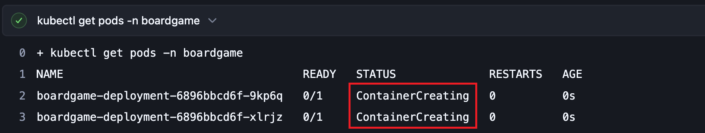

After deploying the Kubernetes cluster, all three Calico node pods entered `CrashLoopBackOff` across all nodes simultaneously. The `mount-bpffs` init container was failing — Calico v3.27.2 has a known bug where the BPF filesystem mount fails on ARM64 nodes. This is not a configuration error and cannot be fixed by adjusting YAML. The only resolution was to delete the broken Calico installation and reinstall with v3.27.0, which does not have this bug. Without a working CNI, no pods can start anywhere in the cluster because Kubernetes cannot assign IP addresses to them.

### SonarQube coverage discrepancy — 91% JaCoCo vs 37.9% SonarQube

JaCoCo reported 91% line coverage while SonarQube showed 37.9%. Three root causes combined to produce this discrepancy. First, `sonar.jacoco.reportPath` — the property used to configure the coverage report path — was deprecated and removed in SonarQube 9+. The correct property is `sonar.coverage.jacoco.xmlReportPaths` pointing to the XML report rather than the binary `.exec` file. Second, SonarQube was analysing HTML, JavaScript, CSS and SQL files as source. Since no coverage tool instruments these languages, they all showed 0% coverage and were averaged into the overall metric alongside Java. Third, `sonar.exclusions` and `sonar.coverage.exclusions` are entirely different properties — the former excludes files from analysis entirely, the latter only from the coverage calculation. The fix was setting `sonar.sources=src/main/java,src/main/resources` to analyse all files for quality while setting `sonar.coverage.exclusions=src/main/resources/**` to restrict coverage measurement to Java only.

### Grafana variable parsing — `$variable` vs `${variable}`

Several Grafana dashboard panels returned no data despite the underlying Prometheus queries working correctly. The root cause was Grafana's variable parser consuming characters beyond the variable name when the variable was followed by a hyphen. For example `$job` in the query `job="$job"` — where the job value was `node-exporter-jenkins-host` — caused Grafana to interpret `$node` as the variable name, consuming the hyphen and everything after it. The fix was to always use `${variable}` syntax which explicitly bounds the variable name and prevents the parser from consuming adjacent characters. Additionally, the Prometheus label name used in queries (`instance=`) was discovered to be different from the Grafana variable name (`node`) — the variable stores `instance` label values fetched from `node_uname_info` but is named `node` in Grafana. Understanding that **the Grafana variable name and the Prometheus label name are independent** — the variable name is what you use in the query reference, the label name is what appears on the left side of the `=` operator — resolved all remaining no-data issues across the dashboard.

### PSI pressure metrics not collected by default

The Node Exporter Full dashboard includes pressure metrics (`node_pressure_cpu_waiting_seconds_total`, `node_pressure_memory_waiting_seconds_total`, `node_pressure_io_waiting_seconds_total`) which measure Linux PSI — Pressure Stall Information. These metrics showed no data despite Node Exporter running correctly. The root cause was that the PSI collector is not enabled by default in Node Exporter. The fix was to add `--collector.pressure` to the Node Exporter startup command in the compose file. PSI also requires Linux kernel 4.20 or above with PSI support enabled — verified by checking `/proc/pressure/cpu` on the host.

---

## References

- [Jenkins Declarative Pipeline Syntax](https://www.jenkins.io/doc/book/pipeline/syntax/)
- [SonarQube Java Coverage Documentation](https://docs.sonarsource.com/sonarqube-server/analyzing-source-code/test-coverage/java-test-coverage)
- [JaCoCo Maven Plugin](https://www.jacoco.org/jacoco/trunk/doc/maven.html)
- [Trivy Documentation](https://trivy.dev/latest/)
- [Nexus Repository Manager](https://help.sonatype.com/en/nexus-repository-manager.html)
- [Spring Security Reference](https://docs.spring.io/spring-security/reference/)
- [Kubernetes RBAC](https://kubernetes.io/docs/reference/access-authn-authz/rbac/)
- [Calico CNI](https://docs.tigera.io/calico/latest/about/)
- [Lombok Changelog](https://projectlombok.org/changelog)
- [JaCoCo Java 25 Support](https://www.jacoco.org/jacoco/trunk/doc/changes.html)
- [Prometheus Documentation](https://prometheus.io/docs/)
- [Grafana Template Variables](https://grafana.com/docs/grafana/latest/datasources/prometheus/template-variables/)
- [Blackbox Exporter](https://github.com/prometheus/blackbox_exporter)
- [Node Exporter](https://github.com/prometheus/node_exporter)

---

## Contact

Let's connect!

[](https://www.linkedin.com/in/ayodejiadeboyejo/)